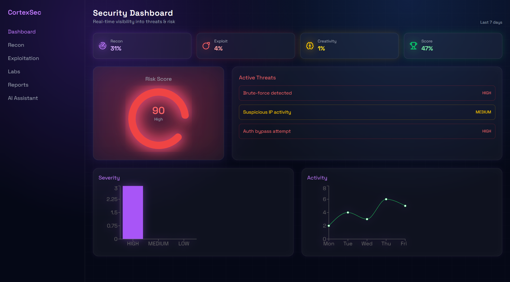
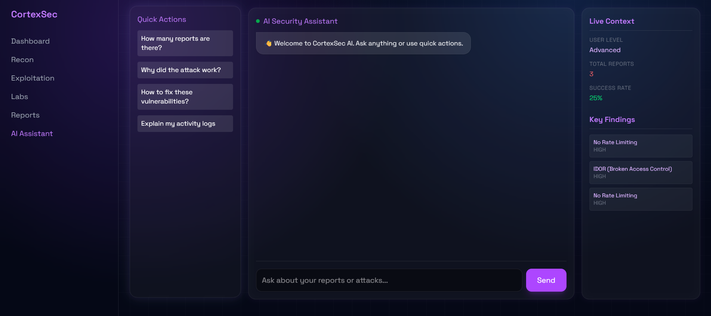
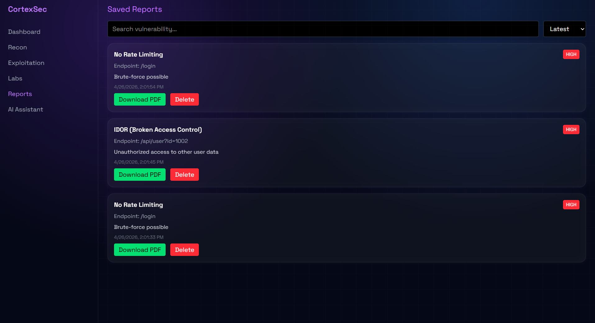
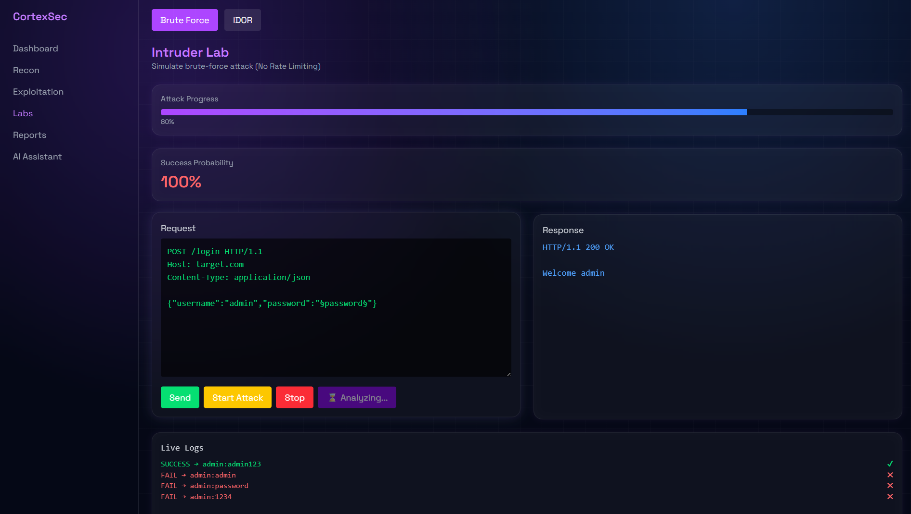

# CortexSec 🛡️
### AI-Powered Cybersecurity Learning & Analysis Platform

CortexSec is a modern, context-aware cybersecurity ecosystem designed to bridge the gap between theoretical learning and practical security analysis. It combines interactive attack labs with an intelligent AI engine that acts as both a SOC mentor and a technical vulnerability analyzer.

---

## 🚀 Overview
In an era of automated threats, security professionals need more than just static tutorials. CortexSec provides a dynamic environment where users can perform real-world attacks, while an integrated AI continuously monitors activity, explains vulnerabilities in real-time, and generates professional-grade security reports.

---

## 🔥 Key Features

### 🧪 Interactive Labs
Experience hands-on offensive security scenarios:
- **Intruder Lab**: Simulate **Brute Force** attacks and identify **No Rate Limiting** vulnerabilities.
- **Access Lab**: Explore **Broken Access Control** through **Insecure Direct Object Reference (IDOR)** scenarios.

### 🤖 AI Security Assistant
A context-aware mentor that lives inside the app:
- **Context-Aware**: Uses your live reports, logs, and user profile to give relevant advice.
- **Adaptive**: Automatically adjusts its technical depth based on your skill level (Beginner → Advanced).

### 🧠 AI Attack Analyzer
A powerful diagnostic tool that acts like a real-world scanner:
- **Log Parsing**: Analyzes raw attack logs to identify the exact root cause.
- **Automated Intelligence**: Detects vulnerability types, determines severity, and suggests precise technical fixes.

### 📊 Real-Time Dashboard
Visualize your security posture:
- **Risk Scoring**: Dynamic radial meters showing real-time system risk.
- **Threat Monitoring**: Live tracking of active security threats.
- **Data Visualization**: Severity distribution and activity trends powered by Recharts.

### 📄 Professional Reporting
- **Persistent Storage**: All reports are saved to a **Google Cloud Firestore** database, ensuring you never lose your progress even after a refresh or logout.
- **Auto-Generation**: Instant creation of structured vulnerability reports.
- **Compliance Ready**: Severity classification, impact analysis, and remediation steps.
- **Exportable**: Save findings as PDF reports for documentation.

---

## 🧠 The Role of AI
CortexSec doesn't just use a generic chatbot. Our AI is a **system-aware security engine**:
- **Log Analyzer**: It reads raw traffic to find patterns humans might miss.
- **Personalized Mentor**: It tracks your success rate and attempts to guide your learning path.
- **Decision Support**: It helps you understand "Why this worked" and "How to fix it" using real application data.

---

## ⚙️ Tech Stack

- **Frontend**: React (Vite), Tailwind CSS, Recharts, Lucide Icons
- **Backend**: Node.js, Express
- **Database**: Google Cloud Firestore (Persistent Storage)
- **Intelligence**: Google Gemini AI (Pro & Flash models)
- **Deployment**: Google Cloud Run (Containerized Full-Stack)

---

## 🏆 Why CortexSec Stands Out
Unlike static learning platforms, CortexSec is a **hybrid analysis tool**. It simulates a real-world SOC/Pentesting environment where the AI isn't just an assistant—it's an integral part of the security workflow. It demonstrates the future of **AI-assisted cybersecurity**.

---

## 💡 Impact & Use Cases
- **Cybersecurity Beginners**: Learn fundamental vulnerabilities without complex setups.
- **SOC Training**: Practice monitoring and analyzing attack patterns in a safe environment.
- **Pentesting Practice**: Refine reporting skills and vulnerability classification.

---

## 📸 Screenshots

---

## 🚀 Future Roadmap
- **Advanced Labs**: XSS, SQL Injection, and SSRF modules.
- **Live Threat Simulation**: Automated bots attempting to breach the lab.
- **Team Collaboration**: Shared report repositories for security teams.
